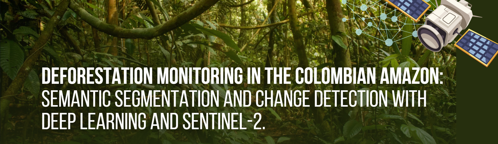
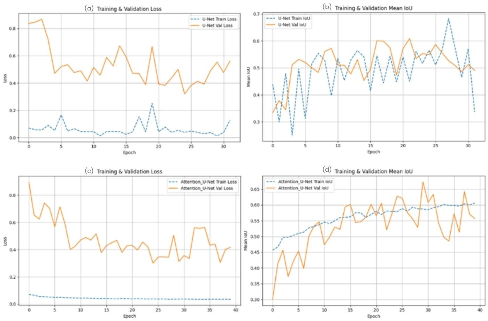
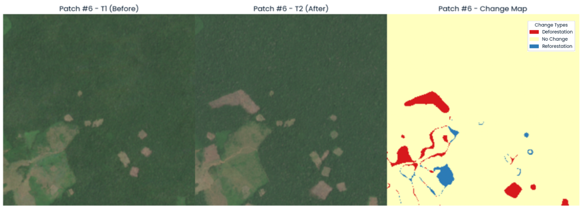

This repository contains the complete code and documentation for an end-to-end deep learning project for forest change analysis in Colombia. The project leverages Sentinel-2 satellite imagery and a U-Net architecture to perform semantic segmentation for land cover classification, with training data sourced from Google's Dynamic World dataset.

## Table of Contents
- [Project Objective](#project-objective)
- [Technical Stack](#technical-stack)
- [Workflow Overview](#workflow-overview)
- [Repository Structure](#repository-structure)
- [Setup and Installation](#setup-and-installation)
- [How to Run](#how-to-run)
- [Results](#results)
- [Future Work](#future-work)
- [Acknowledgements](#acknowledgements)

## Project Objective

The primary goal of this project is to develop an automated pipeline to identify and quantify deforestation over large areas. By training a U-Net models to accurately classify land cover, we can compare predictions from different time periods (e.g., 2021 vs. 2023) to generate forest change maps.

## Technical Stack
This project was developed and executed using a combination of planetary-scale cloud platforms for data engineering and a high-performance computing environment for model training.

-   **Cloud Platform & Data Sourcing:**
    -   **Google Earth Engine (GEE):** Used for all large-scale geospatial data acquisition and pre-processing, including satellite image filtering, cloud masking, and composite creation.
    -   **Google Drive:** Utilized for the robust export and storage of the generated TFRecord datasets.

-   **High-Performance Computing (HPC):**
    -   **Platform:** University of Manchester Computational Shared Facility 3 (CSF3).
    -   **Hardware Configuration:** A single node equipped with a **32-core CPU**, **88 GB of system RAM**, and accelerated by a single **NVIDIA Tesla V100-SXM2 GPU** with 16 GB of VRAM.
    -   **Job Scheduler:** Slurm Workload Manager.

-   **Programming & Deep Learning:**
    -   **Programming Language:** Python 3.12
    -   **Deep Learning Framework:** TensorFlow (v2.x) with the Keras API.
    -   **Core Scientific Libraries:** `numpy` for numerical operations, `pandas` for results logging, `scikit-learn` for final metric reporting, and `matplotlib` / `seaborn` for visualization.
    -   **Geospatial & System Libraries:** `earthengine-api` for GEE interaction, `glob` and `os` for file system management, `psutil` for hardware monitoring.

-   **Primary Geospatial Data:**
    -   **Input Features:** Sentinel-2 Level-2A (L2A) Surface Reflectance imagery (`COPERNICUS/S2_SR_HARMONIZED`).
    -   **Ground-Truth Labels:** Google Dynamic World V1 Land Cover data (`GOOGLE/DYNAMICWORLD/V1`).


## Workflow Overview

The project is divided into two main phases:

1.  **Phase 1: Data Engineering (Google Earth Engine)**
    - A cloud-free, median composite of Sentinel-2 imagery is created for the year 2022 over the Colombian Area of Interest.
    - Cloud and shadow masking is applied using the SCL band for data quality.
    - A corresponding label image is generated using the `mode()` of the Dynamic World collection.
    - The stacked feature and label images are exported as 256x256 pixel patches in TFRecord format to Google Drive.

2.  **Phase 2: Model Training & Inference (Local/Cloud VM)**
    - A `tf.data` pipeline efficiently loads and parses the TFRecord files.
    - A U-Net model is built and trained on the prepared dataset.
    - The trained model is evaluated, and its predictions are visualized against the ground truth labels.
    - The final model is used to perform forest change analysis.

## Repository Structure
```
├── README.md
├── requirements.txt
├── notebooks/
│   ├── 00-data-exploration.ipynb
├── src/
│   ├── 01-data-export.py
│   ├── 02.0-train-unet.py
│   ├── 02.1-train-att-unet.py
│   ├── 03-change-detection-analysis.py
└── report/
│   ├── EAN-11513507-report.pdf
│   ├── EAN-11513507-slides.pdf
└── figures/
```

## Setup and Installation

1.  **Clone the repository:**
    ```bash
    git clone https://github.com/your-username/sentinel2-unet-deforestation.git
    cd sentinel2-unet-deforestation
    ```

2.  **Set up a Python virtual environment (recommended):**
    ```bash
    python -m venv venv
    source venv/bin/activate  # On Windows, use `venv\Scripts\activate`
    ```

3.  **Install the required packages:**
    ```bash
    pip install -r requirements.txt
    ```

4.  **Authenticate with Google Earth Engine:**
    ```bash
    earthengine authenticate
    ```

## How to Run

1.  **Data Export:** Open and run the `notebooks/01_GEE_Data_Exploration_and_Export.ipynb` notebook. This will guide you through the GEE data processing and trigger the export script (`src/gee_export.py`). Wait for the export task to complete in Google Drive.

2.  **Download Data:** Manually download the exported TFRecord files from your Google Drive `GEE_Colombia_Production_Export` folder and place them in a `data/tfrecords` directory within this project (create it if it doesn't exist).

3.  **Model Training:** Open and run the `notebooks/02_Model_Training_and_Evaluation.ipynb` notebook. This will load the data, train the U-Net model, and generate evaluation results and visualizations.

## Results

This project successfully developed and validated a deep learning pipeline for deforestation analysis. The key findings are presented below.

### 1. Model Performance: Attention U-Net Shows Superiority

Two models, a baseline U-Net and an Attention U-Net, were trained on a nuanced 4-class land cover problem. The Attention U-Net demonstrated a more stable training process and achieved a higher peak validation Mean IoU (**0.674**) compared to the standard U-Net (**0.609**), indicating a better performance on the core segmentation task.


> *Figure: Training and validation learning curves. The Attention U-Net (bottom) shows a more stable progression and reaches a higher peak IoU.*

In the final binary (Forest vs. Non-Forest) evaluation, the Attention U-Net proved to be the more effective and balanced model for the project's goal.

| Model             | Precision (Forest) | Recall (Forest) | F1-Score (Forest) | Overall Accuracy |
| :---------------- | :----------------- | :-------------- | :---------------- | :--------------- |
| U-Net             | 0.99               | 0.85            | 0.91              | 92.07%           |
| **Attention U-Net** | 0.96               | **0.90**        | **0.93**          | **93.47%**     |

### 2. Qualitative Analysis: Clearer Predictions

Visual inspection confirms the quantitative results. The Attention U-Net produces cleaner segmentation masks that align more closely with the ground truth, particularly in transitional zones where the standard U-Net tended to confuse classes.


> *Figure: Visual comparison showing the Attention U-Net's (d) output is visibly more accurate than the standard U-Net's (c) when compared to the ground truth (b).*

### 3. Change Detection: Quantifying Deforestation

The validated Attention U-Net model was applied to a **4,430 km²** deforestation hotspot in the San José del Guaviare region to analyze changes between 2021 and 2023. The analysis revealed a **net forest loss of 177.30 km²**.

| Change Type       | Area (km²) |
| :---------------- | :--------- |
| **Deforestation** | **232.15** |
| **Reforestation** | 54.85      |
| **Net Change**    | **-177.30**|

This result translates the model's technical success into an actionable environmental insight.


> *Figure: Example of the generated change map, where red indicates deforestation and blue indicates reforestation between 2021 and 2023.*

## Future Work

The success of this pipeline opens several exciting avenues for future research and development.

-   **Architectural Exploration:**
    -   Test a hybrid U-Net that replaces its simple encoder with a pre-trained, efficient backbone like **EfficientNet**. This could synergize the proven feature extraction power of a modern classifier with the U-Net's superior localization structure.
    -   Explore architectures beyond the convolutional paradigm, such as the Transformer-based **SegFormer**, to potentially achieve performance gains by better capturing long-range spatial context.

-   **Data Enhancement:**
    -   Improve the training set by fusing the Dynamic World labels with other ground-truth sources, such as regional data from local environmental agencies or manually verified points, to create a more robust and accurate set of labels.
    -   Incorporate additional data sources like elevation models (DEM) or Synthetic Aperture Radar (SAR) data as input features to help the model differentiate spectrally similar classes.

-   **Operationalization:**
    -   Extend the analysis to a finer temporal resolution, moving from annual to **seasonal or quarterly composites** to provide earlier warnings of deforestation.
    -   Deploy the entire workflow on a cloud platform like Vertex AI to create a **near-real-time monitoring tool** that automatically ingests new Sentinel-2 imagery and flags areas of significant forest change.

## Acknowledgements
- The Copernicus Sentinel-2 program for providing open-access satellite imagery.
- The Google Earth Engine and Dynamic World teams for their invaluable data and platforms.
-  To my supervisors, Professor David Schultz and Dr. Polyanna Bispo, for believing in this project and guiding it with their domain knowledge.
